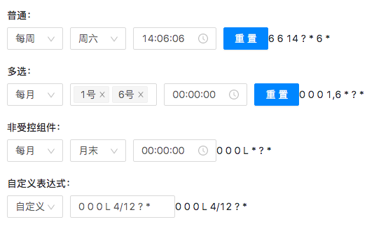

# react-cron

目前市面上的 Cron 表达式相对复杂，可是实际场景中用不到太过复杂的，故开发此组件。

特点

-   使用简单
-   易于理解

# api

| 参数         | 说明                 | 类型            | 默认值 |
| ------------ | -------------------- | --------------- | ------ |
| defaultValue | 指定默认值           | String          | -      |
| value        | 指定当前 Cron 值     | String          | -      |
| onChange     | 修改 Cron 调用此函数 | function(value) | -      |
| multiple     | 是否可以多选         | Boolean         | -      |

# 示例

<div align="left">
    
</div>

```jsx
import React, { Fragment, useState } from 'react';
import ReactDOM from 'react-dom';
import { Button } from 'antd';
import 'antd/dist/antd.css';
import Corn from './src/index.js';

const ml10 = { marginLeft: 10 };
const mt20 = { marginTop: 20 };

export default function CornDemo() {
    const [value, setValue] = useState('6 6 14 ? * 6 *');
    const [value2, setValue2] = useState('0 0 0 1,6 * ? *');
    const [value3, setValue3] = useState('0 0 0 L * ? *');
    const [value4, setValue4] = useState('0 0 0 L 4/12 ? *');
    return (
        <Fragment>
            <h4>普通：</h4>
            <Corn
                value={value}
                onChange={value => {
                    setValue(value);
                }}
            />
            <Button
                style={ml10}
                onClick={() => {
                    setValue('0 0 0 2 * ? *');
                }}
                type="primary"
            >
                重置
            </Button>
            {value}

            <h4 style={mt20}>多选：</h4>
            <Corn
                value={value2}
                onChange={value => {
                    setValue2(value);
                }}
                multiple
            />
            <Button
                style={ml10}
                onClick={() => {
                    setValue2('6 4 4 ? * 1,3,5 *');
                }}
                type="primary"
            >
                重置
            </Button>
            {value2}

            <h4 style={mt20}>非受控组件：</h4>
            <Corn
                defaultValue={value3}
                onChange={value => {
                    setValue3(value);
                }}
            />
            {value3}

            <h4 style={mt20}>自定义表达式：</h4>
            <Corn
                value={value4}
                onChange={value => {
                    setValue4(value);
                }}
            />
            {value4}
        </Fragment>
    );
}
```
